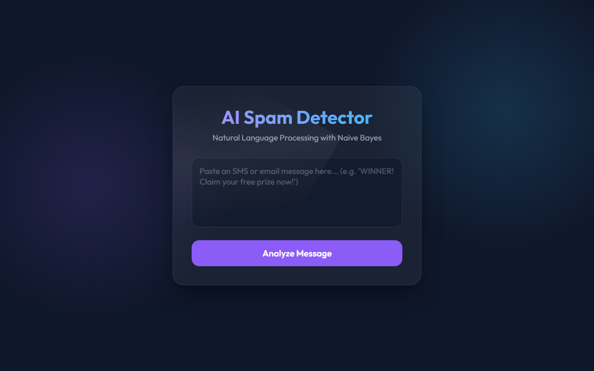
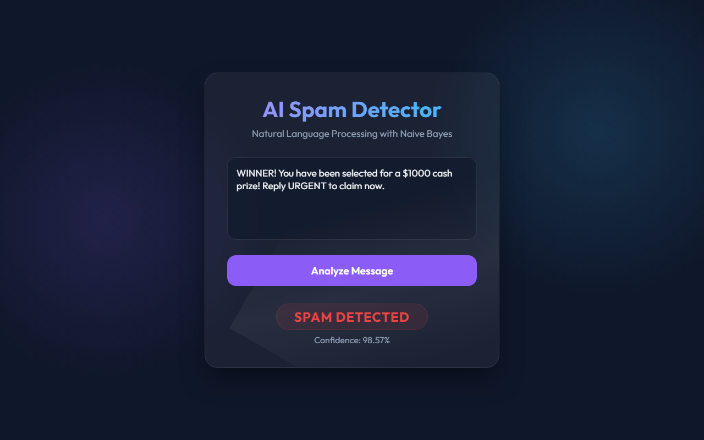
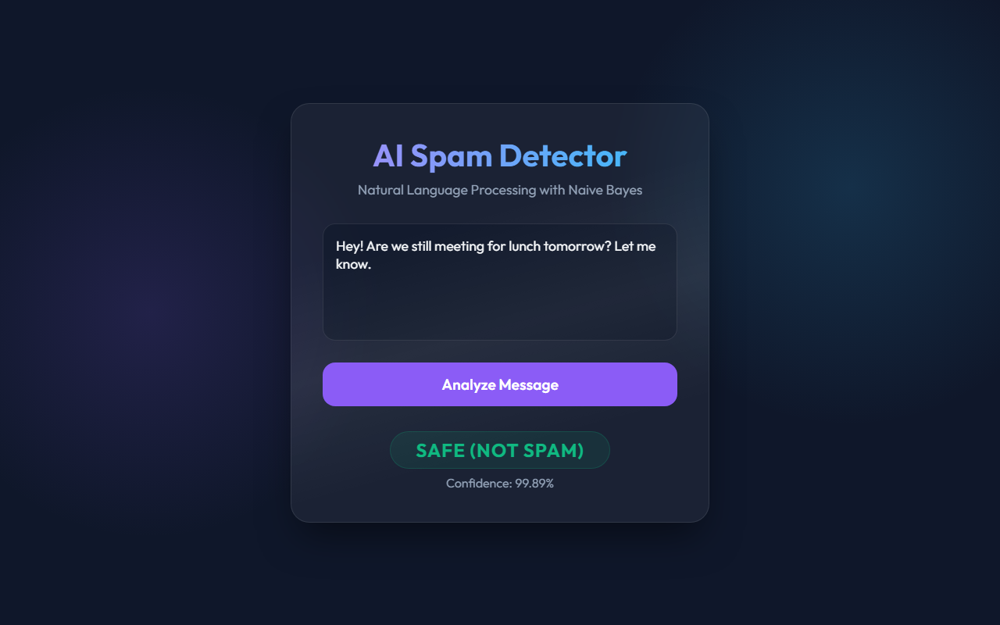
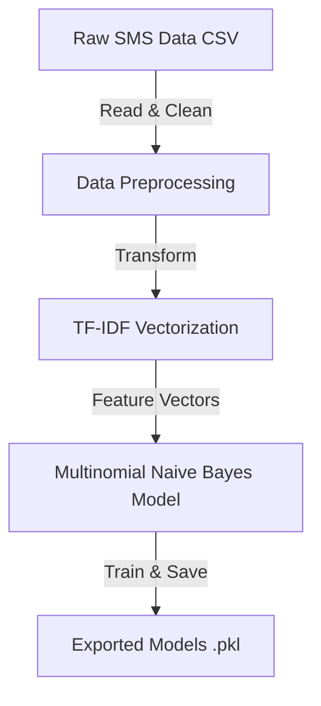
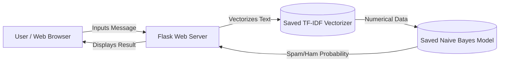

<div align="center">
  
  # 🚀 AI SMS Spam Classifier
  
  **A gentle, interactive introduction to Natural Language Processing (NLP).**
  
  
  
  
  
  

  <br>

  <p>
    Have you ever wondered how your phone automatically filters out spam text messages? This repository demystifies the magic! Using the classic <b>UCI SMS Spam Collection</b> dataset, we build a robust Machine Learning pipeline from scratch that correctly identifies spam with <b>97.8% Accuracy</b>.
  </p>

</div>

---

## 📸 Application Showcase

<div align="center">
  
  
  <br>

  
  
</div>

---

## 🌟 Key Features

- **Automated Pipeline:** The `train_model.py` script dynamically downloads the dataset, cleans it, trains the model, and exports the intelligence.
- **High Accuracy:** Utilizes `TfidfVectorizer` and a `MultinomialNB` (Naive Bayes) classifier to achieve state-of-the-art results on standard datasets.
- **Glassmorphism UI:** Test the AI in real-time through a beautiful, responsive, animated Flask web application.

---

## 🏗️ System Architecture

### 1️⃣ Machine Learning Training Pipeline


### 2️⃣ Application Architecture


---

## 🧠 The Magic Behind It (NLP Explained gently)

To make a computer understand text, we need to translate words into numbers. We achieve this using two powerful concepts:

### 1️⃣ TF-IDF Vectorization
Computers can't read words like *"WINNER"* or *"Hello"*. **TF-IDF (Term Frequency-Inverse Document Frequency)** is a mathematical formula that converts text into arrays of numbers by evaluating how important a word is to a message.
- Words like *"the"* appear everywhere, so they get a **low score**.
- Words like *"Urgent"* or *"Prize"* are rare overall but common in spam, so they get a **high score**.

### 2️⃣ Naive Bayes Classifier
Once the text is vectorized, **Multinomial Naive Bayes** calculates probabilities based on Bayes' Theorem. If a message contains a combination of words that appeared frequently in spam during the training phase, the algorithm flags it as **SPAM**.

---

## 🚀 Getting Started

### Prerequisites
Make sure you have Python 3.8+ installed on your machine.

### 1. Clone the Repository
```bash
git clone https://github.com/iamnitishpattar/SMS-spam-classifier.git
cd SMS-spam-classifier
```

### 2. Install Dependencies
Install the required libraries (we recommend using a virtual environment).
```bash
pip install -r requirements.txt
```

### 3. Train the Brain
Run the training script. It will download the data, train the algorithm, and save the models in a new `models/` directory.
```bash
python train_model.py
```

### 4. Launch the Web App
Experience the AI through the interactive UI!
```bash
python app.py
```
🌐 Open your browser and navigate to `http://127.0.0.1:5000/`. Type in a message and see if the AI gets tricked!

---

## 📊 Model Evaluation
On a 20% holdout test set (1,115 messages), the model achieved:
- **Accuracy:** `97.85%`
- **False Positives:** `0` (Zero normal messages were accidentally flagged as spam!)

---

## 🤝 Contributing
Contributions, issues, and feature requests are welcome! Feel free to check the [issues page](https://github.com/iamnitishpattar/SMS-spam-classifier/issues).

## 📝 License
This project is [MIT](LICENSE) licensed.

<div align="center">
  <i>Crafted with ❤️ by Nitish Pattar</i>
</div>
